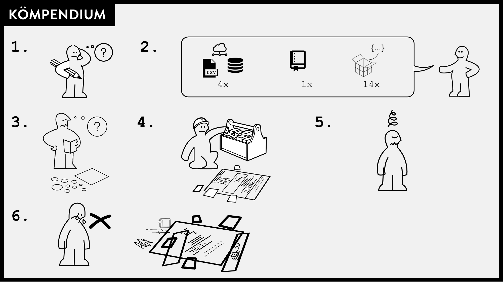

# Greenland ice sheet mass balance from 1840 through next week

This is the source for "Greenland ice sheet mass balance from 1840 through next week" and previous and subsequent versions.

- Paper: [doi:10.5194/essd-13-5001-2021](https://doi.org/10.5194/essd-13-5001-2021)
- Data: [doi:10.22008/FK2/OHI23Z](https://doi.org/10.22008/FK2/OHI23Z) — all daily historical versions archived
- Code: https://github.com/GEUS-Glaciology-and-Climate/mass_balance
  - [Issues](https://github.com/GEUS-Glaciology-and-Climate/mass_balance/issues) — bug reports, suggested improvements, related papers
  - This [diff](https://github.com/GEUS-Glaciology-and-Climate/mass_balance/compare/published...main) shows changes since the published paper version
  - Major changes post-publication are tagged [major_change](https://github.com/GEUS-PROMICE/mass_balance/issues?q=label%3Amajor_change)

> [!WARNING]
> Before using the data check for any open issues tagged [WARNING](https://github.com/GEUS-Glaciology-and-Climate/mass_balance/labels/WARNING).

---

## Workflow

All scripts live in `scripts/` and are controlled by `Makefile`. Run `make help` to list available targets.

### Requirements

- `$DATADIR` must be set to the path containing all raw input data (~300 GB of RCM outputs and ancillary datasets — not included in this repository)
- [Docker](https://www.docker.com/) must be available; the workflow uses two containers:
  - `hillerup/tmb_grass` — all GRASS GIS / bash operations
  - `hillerup/tmb_conda` — all Python operations
- Pull the containers with `make docker`

### Running the full pipeline

```bash
export DATADIR=/path/to/data
make docker     # pull Docker images
make setup      # one-time GRASS setup (import ROIs, create ice masks)
make SMB        # extract SMB from all RCMs → tmp/SMB.nc
make BMB        # compute basal melt → tmp/BMB.nc
make dist       # build TMB NetCDF and upload to THREDDS
```

Or in one go:

```bash
make all
```

### Operational update (new RCM data)

```bash
make update
```

Removes forecasted data for the surrounding ~10 days, re-runs SMB and BMB with `RECENT=true` (last 2–30 files only), and uploads results.

---

### Pipeline stages

#### Stage 1 — GRASS setup (`scripts/setup_*.sh`)

One-time setup, tracked with stamp files in `.stamps/`. Creates four GRASS databases:

| Database | Projection | Script | Purpose |
|---|---|---|---|
| `G_HIRHAM` | EPSG:4326 rotated pole | `setup_hirham.sh` | Import pre-projected ROI shapefiles, create ice mask from `glacGRL`, expand ROIs |
| `G_HIRHAM_XY` | XY (dimensionless) | *(created by setup_hirham.sh)* | Holds raster ROIs in grid-index space for SMB extraction |
| `G_MAR` | EPSG:3413 | `setup_mar.sh` | Import ROIs, create ice mask from fractional `msk` variable (≥50%), expand ROIs |
| `G_RACMO` | EPSG:3413 | `setup_racmo.sh` | Import ROIs, create ice mask from `Promicemask` (≥2), expand ROIs |

ROI expansion: for each model domain cell not covered by a sector/basin polygon, the cell is assigned to the nearest ROI via `r.grow.distance`. This ensures no ice is left unaccounted.

`setup_bmb.sh` also runs in G_MAR and computes the static BMB components (geothermal flux, velocity-based melt) and a `scale` raster for the VHD calculation.

#### Stage 2 — SMB extraction (`scripts/smb_*.sh`)

For each RCM, loops over all (or recent) NetCDF files and extracts daily SMB aggregated to Zwally 2012 sectors and Mouginot 2019 regions via `r.univar`. Each day produces a pair of pipe-separated BSV files in `tmp/{RCM}/`.

| Script | GRASS DB | Notes |
|---|---|---|
| `smb_hirham.sh` | `G_HIRHAM_XY` | Multiplies by `cellarea` before aggregating; band-per-day |
| `smb_mar.sh` | `G_MAR` | MAR has (time, sector, y, x) — odd bands are ice (k=1), even are tundra (k=2) |
| `smb_racmo.sh` | `G_RACMO` | Variable name differs pre/post ERA5 forcing |

#### Stage 3 — SMB merge and NetCDF (`scripts/smb_merge.sh`, `scripts/smb_bsv2nc.py`)

Concatenates daily BSVs into `tmp/{RCM}_{ROI}.bsv`, then converts to `tmp/SMB.nc`. Applies unit conversion (mm → Gt), 15% error, and builds ensemble mean over HIRHAM + MAR.

#### Stage 4 — BMB extraction (`scripts/bmb_mar.sh`)

For each MAR file and day, multiplies the runoff (`ru`) field by the pre-computed `scale` raster to get daily VHD melt, then aggregates to sectors/regions. Output: `tmp/BMB/{sector,region}_YYYY-MM-DD.bsv`.

#### Stage 5 — BMB merge and NetCDF (`scripts/bmb_merge.sh`, `scripts/bmb_bsv2nc.py`)

Same pattern as SMB. Combines GF (static) + velocity melt (static) + VHD (time-varying) → `tmp/BMB.nc`.

#### Stage 6 — TMB assembly (`scripts/build_tmb_nc.py`)

Combines:
- SMB (`tmp/SMB.nc`) — ensemble mean of HIRHAM and MAR
- D — ice discharge from [Mankoff 2020](https://doi.org/10.22008/promice/data/ice_discharge), loaded from `$DATADIR/Mankoff_2020/ice/latest/gate.nc`
- BMB (`tmp/BMB.nc`) — geothermal + velocity + VHD
- Historical reconstruction — [Kjeldsen 2015](https://doi.org/10.1038/nature16183) for 1840–1985, scaled to match the RCM-era observations

D is forecasted 7 days forward using the trend + seasonality of the previous 3 years.

Outputs to `TMB/`:
- `MB_sector.nc` — mass balance by Zwally 2012 sector
- `MB_region.nc` — mass balance by Mouginot 2019 region
- `MB_SMB_D_BMB.csv` — daily totals
- `MB_SMB_D_BMB_ann.csv` — annual totals

#### Stage 7 — Distribution (`make dist`)

Uploads `TMB/*.nc` and `TMB/*.csv` to the GEUS THREDDS server via `upload_cli.py`.

---

### Key files

```
scripts/            all processing scripts (edit directly)
Makefile            pipeline entry point — run 'make help'
docker/             Dockerfiles for both containers
environment.yml     conda environment specification
Mouginot_2019_HIRHAM.gpkg   ROI basins pre-projected to HIRHAM rotated pole
Zwally_2012_HIRHAM.gpkg     ROI sectors pre-projected to HIRHAM rotated pole
G_HIRHAM/           GRASS database (generated, not in repo)
G_HIRHAM_XY/        GRASS database (generated, not in repo)
G_MAR/              GRASS database (generated, not in repo)
G_RACMO/            GRASS database (generated, not in repo)
tmp/
  {RCM}/            daily BSV files per RCM
  SMB.nc            SMB aggregated to sectors and regions
  BMB.nc            BMB (GF + vel + VHD) per sector and region
TMB/
  MB_sector.nc      total mass balance by Zwally sector
  MB_region.nc      total mass balance by Mouginot region
  MB_SMB_D_BMB.csv  daily SMB, D, BMB, MB totals
```

---

## Related work

- Companion paper: "Greenland Ice Sheet solid ice discharge from 1986 through last month"
  - Publication: [doi:10.5194/essd-12-1367-2020](https://doi.org/10.5194/essd-12-1367-2020)
  - Source: https://github.com/GEUS-Glaciology-and-Climate/ice_discharge
  - Data: [doi:10.22008/promice/data/ice_discharge](https://doi.org/10.22008/promice/data/ice_discharge)

- Companion paper: "Greenland liquid water runoff from 1958 through 2019"
  - Paper: [doi:10.5194/essd-12-2811-2020](https://doi.org/10.5194/essd-12-2811-2020)
  - Source: https://github.com/GEUS-PROMICE/freshwater
  - Data: [doi:10.22008/promice/freshwater](https://doi.org/10.22008/promice/freshwater)

---

## Citation

### Publication

```bibtex
@article{mankoff_2021,
  author    = {Mankoff, Kenneth D. and Fettweis, Xavier and Langen,
               Peter L. and Stendel, Martin and Kjeldsen, Kristian K. and
               Karlsson, Nanna B. and Noël, Brice and {van den Broeke},
               Michiel R. and Solgaard, Anne and Colgan, William and
               Box, Jason E. and Simonsen, Sebastian B. and King, Michalea D.
               and Ahlstrøm, Andreas P. and Andersen, Signe Bech and
               Fausto, Robert S.},
  title     = {{G}reenland ice sheet mass balance from 1840 through next week},
  journal   = {Earth System Science Data},
  year      = 2021,
  volume    = 13,
  number    = 10,
  pages     = {5001--5025},
  doi       = {10.5194/essd-13-5001-2021},
  publisher = {Copernicus GmbH}}
```

### Data

```bibtex
@data{mankoff_2021_data,
  author    = {Mankoff, Ken and Fettweis, Xavier and Solgaard, Anne and Langen, Peter and Stendel,
               Martin and Noël, Brice and van den Broeke, Michiel R. and Karlsson, Nanna and Box,
               Jason E. and Kjeldsen, Kristian},
  publisher = {GEUS Dataverse},
  title     = {{G}reenland ice sheet mass balance from 1840 through next week},
  year      = {2021},
  edition   = {VERSION NUMBER},
  doi       = {10.22008/FK2/OHI23Z}}
```

---

## Funding

| Dates | Organization | Program | Effort |
|---|---|---|---|
| 2023 – | NASA GISS | Modeling Analysis and Prediction program | Maintenance |
| 2022 – | GEUS | PROMICE | Distribution (data hosting); maintenance |
| 2018 – 2022 | GEUS | PROMICE | Development; publication; distribution |

## Open science vs. reproducible science

This work is open — every line of code needed to recreate it is included in this git repository, although the ~300 GB of RCM inputs are not. We recognise that "open" is not necessarily "reproducible".

<p align="center"></p>

Source: https://github.com/karthik/rstudio2019
